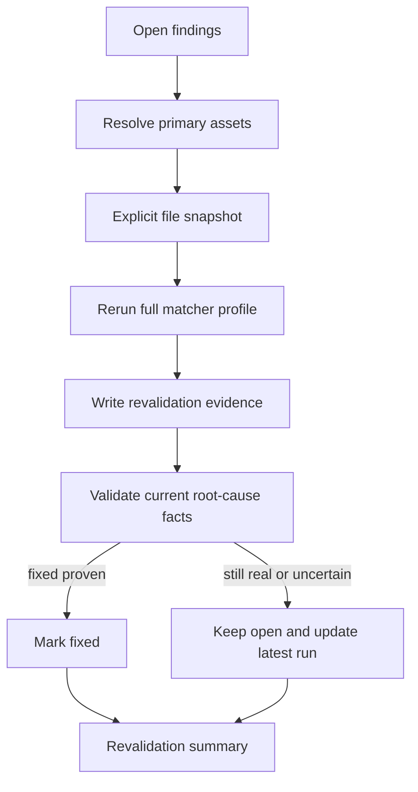

# Architecture

Proofstrike is split into small runtime packages:

```mermaid
flowchart TB
    cli["CLI"] --> stages["Stage resolver"]
    cli --> preflight["Preflight"]
    stages --> ingest["Repository ingest"]
    ingest --> enrich["Context enrichment"]
    ingest --> graph["Code graph"]
    ingest --> scanner["Matcher engine"]
    scanner --> planner["Work planner"]
    graph --> planner
    planner --> knowledge["Knowledge router"]
    knowledge --> agents["Repository explorer + investigator + validator"]
    extensions["Extension registry"] --> scanner
    extensions --> enrich
    extensions --> agents
    extensions --> store
    agents --> store["Evidence store"]
    enrich --> store
    store --> policy["Policy"]
    store --> artifacts["Run artifacts / checkpoints"]
    policy --> reporters["SARIF / Markdown / JSON / PR comment"]
```

The implementation is source-only in the first MVP. It reviews files, route-like handlers, deterministic matcher signals, hotspots, knowledge, and project instructions. Later runtime/black-box modes can reuse the same asset, signal, evidence, validation, and policy model.

## Core Concepts

- **Stage**: controls scope, matcher noise, graph radius, validators, budgets, and policy.
- **Asset**: a file, route, package, AI tool, IaC resource, or future browser artifact.
- **Signal**: a deterministic reason to inspect an asset.
- **Candidate**: merged signals for one primary asset.
- **Work packet**: the unit sent to an investigator.
- **Finding**: a proposed security issue backed by evidence.
- **Validation**: independent confirmation or reduction of confidence.
- **Policy decision**: pass, warn, manual review, or fail.

## Current MVP Flow

1. Load config.
2. Resolve stage.
3. Ingest files and project instructions.
4. Enrich the run with technology-profile, manifest, deployment, ownership, and sensitive-surface evidence.
5. Build a lightweight route/import/auth graph.
6. Load built-in and configured local matcher packs.
7. Run matchers across secrets, injection, auth, CI/CD, supply chain, AI-appsec, container, IaC, framework, and exposure patterns.
8. Merge signals into candidates.
9. Expand candidates by graph radius.
10. Plan work packets.
11. Write checkpoint artifacts for snapshot, code index, signals, candidates, and work packets.
12. Compile bounded prompt context.
13. Execute work packets with locks, retries, concurrency limits, stale-lock recovery, and packet status updates.
14. Run the deterministic investigator or, when configured, a repository-exploring model investigator that can request source reads/searches before final findings.
15. Run fact-decomposing validation, optionally with model-backed consensus.
16. Record model-usage estimates and enforce stage budgets.
17. Evaluate policy.
18. Write findings, validations, and policy-decision artifacts.
19. Render reports.

Programmatic extensions can contribute matchers, ownership providers, notifiers, executor boundaries, and agent implementations. The built-in CLI uses local configuration and JSON matcher packs; embedding applications can use the typed registry directly.

`proofstrike resume` reopens a stored running or errored run, selects queued or errored packets, refreshes the scoped file snapshot, and continues packet execution with the same evidence-store model.

## Revalidation Flow



Revalidation reruns matchers against the current source for files with open findings, records whether the original signal is still present, then asks the validator to decompose the finding into current source facts. A missing signal alone is not enough to close a finding if the validator still sees a plausible root cause.
