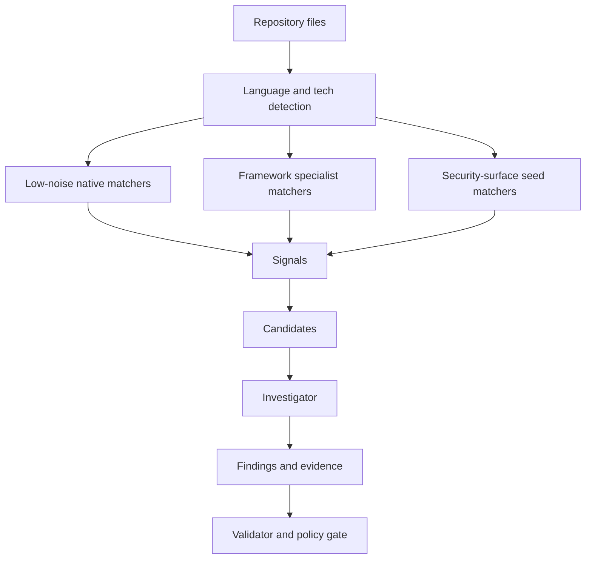

# Matcher Catalog

Proofstrike uses three complementary matcher layers:

1. **Native high-signal matchers** for known security failure modes such as hardcoded credentials, unsafe raw SQL, JWT verification mistakes, privileged AI tools, Kubernetes privilege escalation, Terraform public exposure, Docker image risks, and mobile/desktop hardening gaps.
2. **Framework-specialist matchers** for stack-specific failure modes where the shape of the code matters, such as server actions, route decorators, controller guards, framework validation hooks, strong-parameter patterns, actuator exposure, GraphQL/tRPC public mutations, and Electron preload bridges.
3. **Security-surface seed matchers** for framework and runtime entry points that deserve review in broader stages, even when a vulnerability is not obvious from a single line.

Matchers emit signals, not final findings. The investigator and validator decide whether a signal is reportable.

## Current Surface

The built-in catalog is intentionally broad:

- web frameworks across TypeScript/JavaScript, Python, Go, Ruby, PHP, JVM, .NET, Rust, Swift, Apex, Clojure, Elixir, Erlang, Crystal, Dart, and Lua;
- authentication, authorization, session, OAuth, SAML, LDAP, rate-limit, and webhook-signature failures;
- SQL, NoSQL, SOQL, XML/XPath, LDAP, template, object, mass-assignment, and deserialization injection families;
- RCE, command execution, filesystem, path traversal, archive extraction, upload, and symlink-boundary risks;
- secrets, logs, public environment variables, private keys, cloud keys, package tokens, registry auth, and credential fallbacks;
- AI/MCP/RAG/browser-agent/tooling risks including tool permission gaps, prompt injection, system prompt exposure, model-output execution, and agent memory leaks;
- CI/CD and supply-chain risks across GitHub Actions, GitLab CI, Jenkins, package lifecycle scripts, registries, unpinned dependencies, and plaintext indexes;
- Docker, Compose, Kubernetes, Helm, Terraform, cloud, mobile, and Electron configuration risks.

## Scanner Architecture

The scanner is intentionally split into independently testable pieces:

- `tech.ts` owns technology detection for runtime, framework, manifest, package, and file-content signals.
- `frameworks.ts` owns stack-specific matchers that should only run when the matching technology is present.
- `custom.ts` owns local JSON matcher-pack loading and validation for organization-specific rules.
- `index.ts` owns the registry, generic matchers, seeded surface matchers, line-level signal creation, and catalog metadata.

This keeps broad coverage from becoming only a pile of regular expressions. Framework specialists carry their own scope, examples, mitigation patterns, and false-positive guards, while the registry still gives the orchestrator one uniform signal stream.

## Local Matcher Packs

Teams can add focused rules without editing source by adding a JSON pack inside the repository and listing it in `proofstrike.config.json`:

```json
{
  "packs": [
    "proofstrike.builtins",
    ".proofstrike/custom-matchers.json"
  ]
}
```

Each local matcher has a stable slug, metadata, regular expression, optional negative pattern, optional framework tags, and optional file-path scope. Pack files are constrained to the reviewed repository so CI runs do not load arbitrary files from the host.

## Quality Bar

Every built-in matcher should have:

- a stable slug;
- clear category, severity, confidence, and noise tier;
- language or file-surface scoping where practical;
- line-number evidence;
- a concise message that tells the investigator what to verify;
- examples for seeded security-surface matchers.



## Stage Behavior

- `local` and `pull_request` favor low-noise matchers.
- `dev` uses a focused full-source pass with strict profile.
- `stage` adds medium-noise checks and broader graph context.
- `preprod` and `campaign` allow broad/research-grade surface discovery.

This lets Proofstrike be quiet where developers need speed and broad where release risk matters.
