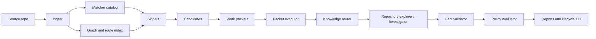

# Platform Depth

Proofstrike is designed to feel like a serious security platform from the first open-source release. The code stays lean, but the product surface is intentionally broad enough for real CI/CD adoption.

## Product Pillars

1. **Progressive review depth**
   - cheap local and pull-request scans;
   - broader dev and stage reviews;
   - release-gate preprod and campaign modes.

2. **Evidence-first findings**
   - assets, signals, candidates, work packets, findings, evidence, validations, and policy decisions are stored as first-class records;
   - every finding can be explained, triaged, exported, revalidated, and suppressed with reason.

3. **Security-surface breadth**
   - native matchers catch concrete vulnerabilities;
   - seeded surface matchers pull important entry points into broader investigation;
   - project hotspots and instructions let teams add business-specific context.

4. **Model independence**
   - deterministic static investigation works without API keys;
   - OpenAI-compatible and LiteLLM-style gateways can add repository-exploring model review;
   - provider-configured failures fail loudly by default, with explicit static fallback available when teams choose it.

5. **CI/CD fit**
   - SARIF, JSON, Markdown, and PR-comment style outputs;
   - policy gates for fail/manual/warn/pass;
- status, export, metrics, controls, triage, explain, and revalidate commands.

## Current Capabilities

## Why The Repository Is Not Tiny

Proofstrike now includes meaningful implementation across:

- `core`: schemas, IDs, evidence store, policies, suppressions, accepted-risk rules;
- `stages`: progressive CI/CD stage presets;
- `ingest`: file, diff, language, tech, instruction, hotspot, and knowledge loading;
- `scanner`: native and seeded matcher catalog;
- `graph`: route/import/auth context;
- `knowledge`: contextual security notes;
- `agents`: prompt compiler, model gateway, repository explorer, investigator, validator, fallback diagnostics, usage estimation;
- `orchestrator`: end-to-end review, packet locks, retries, concurrency, budget checks, and revalidation;
- `reporters`: Markdown, JSON, SARIF, and PR-comment output;
- `standards`: control mapping, release-risk scoring, and standards summaries;
- `cli`: init, doctor, scan, review, report, revalidate, status, export, metrics, controls, triage, explain, and packs;
- `marketplace`: pack install/audit skeleton;
- `tools`: optional external tool adapters;
- `testkit`: fixture helpers and integration-style tests.

The goal is not line-count bulk. The goal is a coherent product shape: enough depth that users can run it, trust it, configure it, and build a workflow around it.
