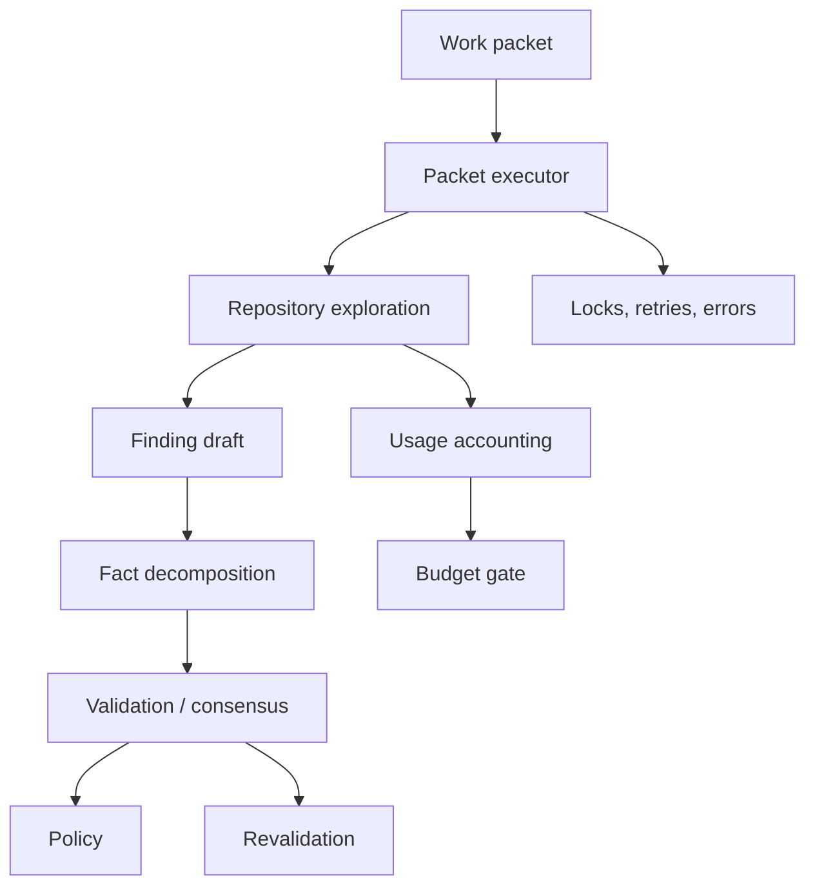

# Security Engine Hardening

This document tracks the concrete engine work needed for a company to trust Proofstrike as an AI-assisted security review tool today.

## Gap Closure Plan

| Area | Assessment | Proofstrike Decision | Implementation |
| --- | --- | --- | --- |
| AI investigation loop | A bounded excerpt prompt is not enough for serious source review. | Add a repository-exploring investigator while keeping deterministic local mode. | `AgenticRepositoryInvestigatorAgent` can request repository reads/searches before returning strict findings. |
| Operational reliability | Security tooling must not lose packet state or treat failures as clean results. | Make work packets stateful and fail-loud by default. | Packet statuses, file locks, stale-lock recovery, retries, resumable runs, run errors, concurrency limits, and model budget checks now live in the orchestrator. |
| Revalidation | Rerunning matchers alone can mark issues fixed too eagerly. | Revalidation must write evidence and ask the validator whether the root cause is fixed. | Revalidation records current signal presence/absence, decomposes finding facts, and marks fixed only when current source no longer supports the root cause. |
| Matcher quality | Raw matcher count is not quality by itself. | Keep breadth, but improve routing into investigation with metadata and category-specific guidance. | Prompt compiler now emits matcher guidance so the investigator checks source, sink, trust boundary, mitigation, and exploitability per category. |
| Fail-loud behavior | Model errors should not silently become successful reviews. | If a provider is configured, failures fail by default. Static fallback must be explicit. | `runtime.modelFailureMode` controls `fail` vs `static-fallback`; malformed JSON, missing keys, timeouts, and gateway errors can block the run. |
| Cost and quota | AI review must be predictable in CI. | Track estimated model usage and enforce stage budgets. | Model usage records include prompt/response chars, estimated tokens, cost, attempts, provider, model, operation, and work-packet ID. |
| Validation quality | One pass can be brittle with non-deterministic models. | Use fact decomposition locally and optional multi-run model consensus. | Validator decomposes each finding into checkable facts; model-backed validation supports configurable repeated runs and consensus. |

## What Does Not Fit Yet

- Full live exploitation does not belong in the white-box MVP. It can be added later as an authorized, separately scoped runtime mode.
- Browser-only black-box review is useful later, but source-first CI review should be excellent before adding a second ingestion model.
- A large external dependency stack is not needed for this layer. The runtime stays dependency-light and provider-agnostic.

## Current Quality Bar

The engine should now satisfy these trust expectations:

- a configured model outage causes visible failure unless fallback is explicitly enabled;
- packet-level failures are recorded and retried;
- queued or errored packets can be resumed from the evidence store;
- packet locks prevent concurrent workers from double-processing the same unit;
- revalidation does not close findings from signal disappearance alone;
- model-backed review can inspect repository files instead of reasoning only over one initial excerpt;
- usage is recorded for audit and stage budget enforcement.
